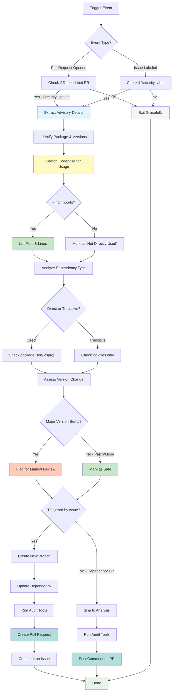

# Security Advisory Responder - Workflow Diagram



## Workflow Steps Explained

### 1. Trigger Detection (A → B → C/D)
- Workflow activates on two events: PR opened or Issue labeled
- Checks if it's a Dependabot security PR or security-labeled issue
- Exits gracefully if neither condition is met

### 2. Advisory Analysis (E → F)
- Extracts vulnerability details from PR/issue body
- Identifies package name, current version, patched version
- Captures CVE/GHSA IDs and severity level

### 3. Usage Detection (G → H → I/J)
- Searches codebase for actual package usage
- For npm: looks for `import` or `require` statements
- For NuGet: looks for `using` statements
- Lists specific files and line numbers where found

### 4. Dependency Classification (K → L → M/N)
- Determines if dependency is direct (in package.json/.csproj)
- Or transitive (only in lockfiles)
- Checks parent dependencies that bring in transitive packages

### 5. Impact Assessment (O → P → Q/R)
- Evaluates version change (major, minor, patch)
- Major version bump → flags for manual review (breaking changes likely)
- Minor/patch → marks as safe to merge

### 6. Action Phase (S → T/U)
**For Issue-triggered workflows (T → V → W → X → Y):**
- Creates new branch with security fix
- Updates dependency to patched version
- Runs audit tools to verify fix
- Creates PR with comprehensive analysis
- Comments on original issue with PR link

**For Dependabot PR workflows (U → AA → AB):**
- Analyzes existing Dependabot changes
- Runs audit tools to verify
- Posts detailed comment with recommendations
- Does NOT create new PR

### 7. Completion (AC)
- Workflow completes successfully
- Maintainers have actionable PR or enhanced Dependabot PR
- Clear merge recommendations provided

## Key Decision Points

### 🔍 Is it a security event?
- **Yes**: Continue with analysis
- **No**: Exit gracefully (no wasted resources)

### 📦 Is the package actually used?
- **Used**: Higher priority, flag for testing
- **Not used**: Lower risk, but still fix it

### 📊 What's the version change?
- **Major**: Breaking changes likely → manual review
- **Minor/Patch**: Usually safe → recommend merge

### 🎯 How was it triggered?
- **Issue**: Create new PR with fix
- **Dependabot PR**: Enhance existing PR with analysis

## Output Types

### For New PRs (Issue-triggered)
```markdown
Title: security: fix [package] vulnerability (GHSA-xxx)
Body:
  - Vulnerability details
  - Impact analysis
  - Usage report
  - Changes made
  - Breaking change warnings
  - Verification results
  - Merge recommendation
```

### For Dependabot PR Comments
```markdown
Comment:
  - Usage analysis for this repo
  - Files where package is imported
  - Breaking change assessment
  - Clear recommendation (✅ Safe / 🔍 Review / 🧪 Test)
```

## Success Metrics

| Metric | Target |
|--------|--------|
| Time to PR creation | < 5 minutes |
| Usage detection accuracy | > 95% |
| Recommendation accuracy | > 90% |
| False positive rate | < 5% |
| Manual intervention needed | < 10% |

## Error Handling

At each stage, if an error occurs:
1. Log the error details
2. Attempt graceful degradation
3. Still provide partial analysis if possible
4. Flag for manual intervention if needed
5. Never block security fixes due to analysis errors

---

**Last Updated:** 2026-02-15
