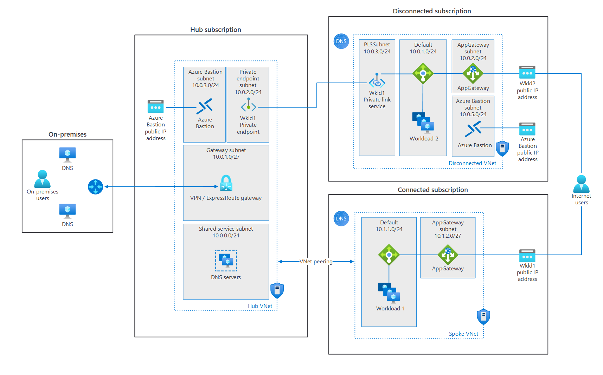
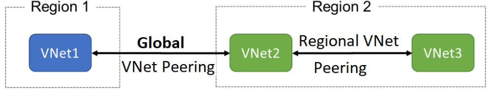

> Work in progress

This blog post summarizes my notes on my course on az-700: the course teaches Network Engineers how to design, implement, and maintain Azure networking solutions. The course covers the process of designing, implementing, and managing core Azure networking infrastructure, Hybrid Networking connections, load balancing traffic, network routing, private access to Azure services, network security and monitoring.

## Virtual Networks

### Capabilities

- Communication with the internet
- Communication between Azure resources
- Communication between on-premises resources
- Filtering network traffic
- Routing network traffic

### Address spaces to be used

- 10.0.0.0 - 10.255.255.255 (10/8 prefix)
- 172.16.0.0 - 172.31.255.255 (172.16/12 prefix)
- 192.168.0.0 - 192.168.255.255 (192.168/16 prefix)

### Subnets

Azure reserves 5 IP addresses within each subnet.

- x.x.x.0: Network address
- x.x.x.1: Reserved by Azure for the default gateway
- x.x.x.2, x.x.x.3: Reserved by Azure to map the Azure DNS IPs to the VNet space
- x.x.x.255: Network broadcast address

## Scopes

All Azure resource types have a scope that defines the level that resource names must be unique. A resource must have a unique name within its scope. There are four levels you can specify a scope:

- Global (Azure Storage Account)
- Management Group
- Subscription
- Resource Group (Azure Virtual Network)
- Resource

## Regions and Subscriptions

A resource can be created in a virtual network in the same region and subscription but virtual network can be connected from different subscriptions and regions

## Availability Zones

An Azure Availability Zone enables you to define unique physical locations within a region. Each zone is made up of one or more data centers equipped with independent power, cooling, and networking. Designed to ensure high-availability of your Azure services, the physical separation of Availability Zones within a region protects applications and data from data center failures.

- Zonal services: Resources can be pinned to a specific zone
- Zone-Redundant services: Resources are replicated across zones automatically
- Non-Regional services: services are always available and are resilient to zone-wide and region-wide outages.

## Public IP

Public IP addresses enable Internet resources to communicate with Azure resources and enable Azure resources to communicate outbound with Internet and public-facing Azure services. A public IP address in Azure is dedicated to a specific resource, until it's unassigned by a network engineer. A resource without a public IP assigned can communicate outbound through network address translation services, where Azure dynamically assigns an available IP address that isn't dedicated to the resource.

> - A **dynamic** public IP address is an assigned address that can change over the lifespan of the Azure resource. The dynamic IP address is allocated when you create or start a VM. The IP address is released when you stop or delete the VM. In each Azure region, public IP addresses are assigned from a unique pool of addresses. The default allocation method is dynamic.
> - A **static** public IP address is an assigned address that will not change over the lifespan of the Azure resource. To ensure that the IP address for the resource remains the same, set the allocation method explicitly to static. In this case, an IP address is assigned immediately. It is released only when you delete the resource or change the IP allocation method to dynamic.

> - Basic SKU: can be assigned by using static or dynamic allocation methods, are open by default, use of NSG is recommended but optional for restricting inbound or outbound traffic. Assignable to to any Azure resource that can be assigned a public IP address, such as network interfaces, VPN gateways, application gateways, and internet-facing load balancers. Availability zone scenarios not supported
> - Standard SKU: always use the static allocation method, are secure by default and closed to inbound traffic, must explicitly allow inbound traffic by using a NSG. Assignable to network interfaces, Standard public load balancers, application gateways, or VPN gateways. Zone-redundant by default and optionally zonal (they can be created zonal and guaranteed in a specific availability zone).

## DNS resolutions

Depending on how you use Azure to host IaaS, PaaS, and hybrid solutions, you might need to allow the virtual machines (VMs), and other resources deployed in a virtual network to communicate with each other. Although you can enable communication by using IP addresses, it is much simpler to use names that can be easily remembered, and do not change.

DNS is split into two areas: Public, and Private DNS for resources accessible from your own internal networks.

### Public DNS Services

Public DNS services resolve names and IP addresses for resources and services accessible over the internet such as web servers. Azure DNS is a hosting service for DNS domain that provides name resolution by using Microsoft Azure infrastructure. DNS domains in Azure DNS are hosted on Azure's global network of DNS name servers. Azure DNS uses anycast networking. Each DNS query is answered by the closest available DNS server to provide fast performance and high availability for your domain.

In Azure DNS, you can create address records manually within relevant zones. The records most frequently used will be:

- Host records: A/AAAA (IPv4/IPv6)
- Alias records: CNAME

Azure DNS provides a reliable, secure DNS service to manage and resolve domain names in a virtual network without needing to add a custom DNS solution.

A DNS zone hosts the DNS records for a domain. So, to start hosting your domain in Azure DNS, you need to create a DNS zone for that domain name. Each DNS record for your domain is then created inside this DNS zone.

You do not have to own a domain name to create a DNS zone with that domain name in Azure DNS. However, you do need to own the domain to configure the domain.

### Delegate DNS Domains

To delegate your domain to Azure DNS, you first need to know the name server names for your zone. Each time a DNS zone is created Azure DNS allocates name servers from a pool. Once the Name Servers are assigned, Azure DNS automatically creates authoritative NS records in your zone.

Once the DNS zone is created, and you have the name servers, you need to update the parent domain. Each registrar has their own DNS management tools to change the name server records for a domain. In the registrar’s DNS management page, edit the NS records and replace the NS records with the ones Azure DNS created.

Note: When delegating a domain to Azure DNS, you must use the name server names provided by Azure DNS. You should always use all four name server names, regardless of the name of your domain.

### Private DNS Services

Private DNS services resolve names and IP addresses for resources and services

When resources deployed in virtual networks need to resolve domain names to internal IP addresses, they can use one the three methods:

- Azure DNS Private Zones
- Azure-provided name resolution
- Name resolution that uses your own DNS server

The type of name resolution you use depends on how your resources need to communicate with each other.

Your name resolution needs might go beyond the features provided by Azure. For example, you might need to use Microsoft Windows Server Active Directory domains, resolve DNS names between virtual networks. To cover these scenarios, Azure provides the ability for you to use your own DNS servers.

DNS servers within a virtual network can forward DNS queries to the recursive resolvers in Azure. This enables you to resolve host names within that virtual network. For example, a domain controller (DC) running in Azure can respond to DNS queries for its domains and forward all other queries to Azure. Forwarding queries allows VMs to see both your on-premises resources (via the DC) and Azure-provided host names (via the forwarder). Access to the recursive resolvers in Azure is provided via the virtual IP 168.63.129.16.

DNS forwarding also enables DNS resolution between virtual networks and allows your on-premises machines to resolve Azure-provided host names. In order to resolve a VM's host name, the DNS server VM must reside in the same virtual network and be configured to forward host name queries to Azure. Because the DNS suffix is different in each virtual network, you can use conditional forwarding rules to send DNS queries to the correct virtual network for resolution.

## Cross-virtual network connectivity with peering

Organizations with large scale operations will often need to create connections between different parts of their virtual network infrastructure. Virtual network peering enables you to seamlessly connect separate VNets with optimal network performance, whether they are in the same Azure region (VNet peering) or in different regions (Global VNet peering). Network traffic between peered virtual networks is private. The virtual networks appear as one for connectivity purposes. The traffic between virtual machines in peered virtual networks uses the Microsoft backbone infrastructure, and no public Internet, gateways, or encryption is required in the communication between the virtual networks.

Virtual network peering enables you to seamlessly connect two Azure virtual networks. Once peered, the virtual networks appear as one, for connectivity purposes. There are two types of VNet peering.

- **Regional peering** connects Azure virtual networks in the same region.
- **Global peering** connects Azure virtual networks in different regions. When creating a global peering, the peered virtual networks can exist in any Azure public cloud region or China cloud regions, but not in Government cloud regions. You can only peer virtual networks in the same region in Azure Government cloud regions.

Benefits:

- A low-latency, high-bandwidth connection between resources in different virtual networks.
- The ability to apply network security groups in either virtual network to block access to other virtual networks or subnets.
- The ability to transfer data between virtual networks across Azure subscriptions, Azure Active Directory tenants, deployment models, and Azure regions.
- The ability to peer virtual networks created through the Azure Resource Manager.
- The ability to peer a virtual network created through Resource Manager to one created through the classic deployment model.
- No downtime to resources in either virtual network is required when creating the peering, or after the peering is created.

## Gateway Transit

Is a peering property that lets one virtual network use the VPN gateway in the peered virtual network for cross-premises or VNet-to-VNet connectivity.

## Traffic routing

- System routes
- Default routes
- custom routes

Default routes

Source | Address prefixes | Next hop type
---|---|---
Default | Unique to the virtual network | Virtual network
Default | 0.0.0.0/0 | Internet
Default | 10.0.0.0/8 | None
Default | 192.168.0.0/16 | None
Default | 100.64.0.0/10 | None
