The term load balancing refers to the even distribution of workloads (that is, incoming network traffic), across a group of backend computing resources or servers. Load balancing aims to optimize resource use, maximize throughput, minimize response time, and avoid overloading any single resource. It can also improve availability by sharing a workload across redundant computing resources.

## Options

- Azure Load Balancer
- Traffic Manager
- Azure Application Gateway
- Azure Front Door

### Azure Load Balancer

High-performance, ultra-low-latency **Layer 4** load-balancing service (inbound and outbound) for all **UDP** and **TCP** protocols. It is built to handle millions of requests per second while ensuring your solution is highly available. Azure Load Balancer is **zone-redundant**, ensuring high availability across **Availability Zones**.

#### Type

They can be public (aka external) or internal (aka private).

**Public** - Provide outbound connections for virtual machines (VMs) inside your virtual network. These connections are accomplished by translating their private IP addresses to public IP addresses. External load balancers are used to distribute client traffic from the internet across your VMs. That internet traffic might come from web browsers, module apps, or other sources.

**Internal** - Is used where private IPs are needed at the frontend only. Internal load balancers are used to load balance traffic from internal Azure resources to other Azure resources inside a virtual network. A load balancer frontend can also be accessed from an on-premises network in a hybrid scenario.

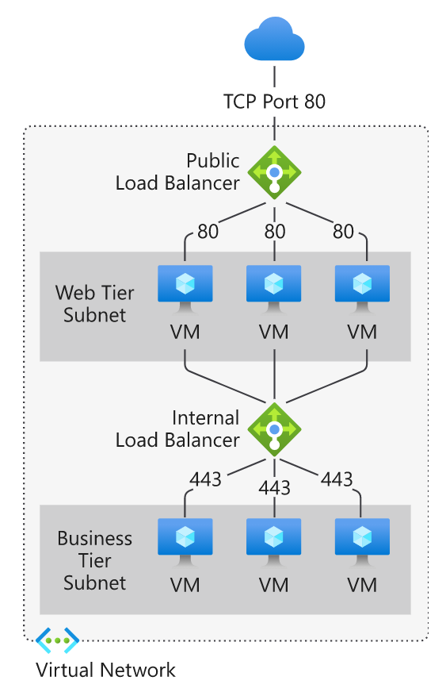

#### Availability zones

Azure Load Balancer can be either zone redundant, zonal or non-zonal.

**Zone redundant** - The traffic s served by a single IP address and it survives zone failure. The frontend IP may be used to reach all non-impacted backend pool members no matter the zone.  One or more availability zones can fail and the data path survives as long as one zone in the region remains healthy.

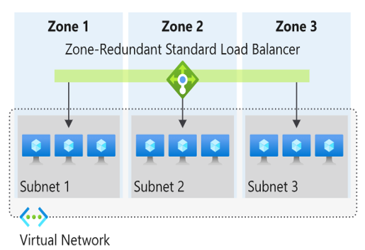

**Zonal** - The frontend is guaranteed to a single zone. Any inbound or outbound flow is served by a single zone in a region. Your frontend shares fate with the health of the zone. The data path is unaffected by failures in zones other than where it was guaranteed. You can use zonal front-ends to expose an IP address per Availability Zone.

Additionally, the use of zonal front-ends directly for load balanced endpoints within each zone is supported. You can use this configuration to expose per zone load-balanced endpoints to individually monitor each zone. For public endpoints, you can integrate them with a DNS load-balancing product like Traffic Manager and use a single DNS name.

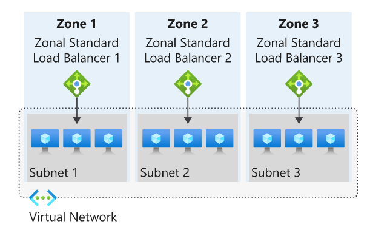

#### SKU

There are 2 SKUs available: Standard and basic.

Features | Standard Load Balancer | Basic Load Balancer
--- | --- | ---
Backend pool size | Supports up to 1000 instances. | Supports up to 300 instances.
Backend pool endpoints | Any virtual machines or virtual machine scale sets in a single virtual network. | Virtual machines in a single availability set or virtual machine scale set.
Health probes | TCP, HTTP, HTTPS | TCP, HTTP
Health probe down behavior | TCP connections stay alive on an instance probe down and on all probes down. | TCP connections stay alive on an instance probe down. All TCP connections end when all probes are down.
Availability Zones | Zone-redundant and zonal front-ends for inbound and outbound traffic. | Not available
Diagnostics | Azure Monitor multi-dimensional metrics | Azure Monitor logs
HA Ports | Available for Internal Load Balancer | Not available
Secure by default | Closed to inbound flows unless allowed by a network security group. Internal traffic from the virtual network to the internal load balancer is allowed. | Open by default. Network security group optional.
Outbound Rules | Declarative outbound NAT configuration | Not available
TCP Reset on Idle | Available on any rule | Not available
Multiple front ends | Inbound and outbound | Inbound only
Management Operations | Most operations < 30 seconds | 60-90+ seconds typical
SLA | 99.99% | Not available

### Traffic Manager

**DNS-based** traffic load balancer that enables you to distribute traffic optimally to services across **global Azure regions**, while providing high availability and responsiveness. Because Traffic Manager is a DNS-based load-balancing service, it load-balances only at the **domain level**. For that reason, it can't fail over as quickly as Front Door, because of common challenges around DNS caching and systems not honoring DNS time-to-live values (TTLs).

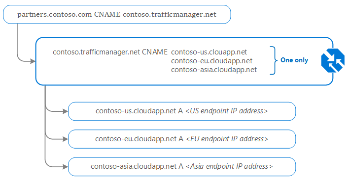

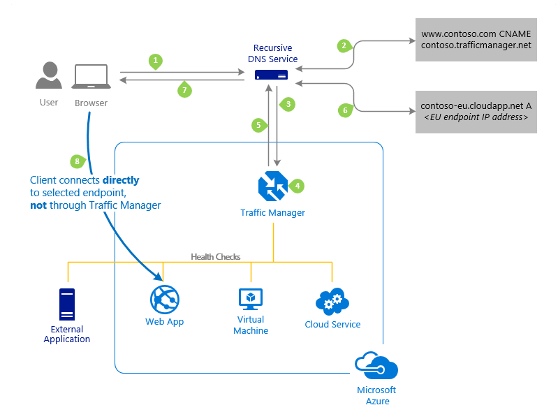

1. The client sends a DNS query to its configured recursive DNS service to resolve the name ‘partners.contoso.com’. A recursive DNS service, sometimes called a 'local DNS' service, does not host DNS domains directly. Rather, the client off-loads the work of contacting the various authoritative DNS services across the Internet needed to resolve a DNS name.

2. To resolve the DNS name, the recursive DNS service finds the name servers for the ‘contoso.com’ domain. It then contacts those name servers to request the 'partners.contoso.com' DNS record. The contoso.com DNS servers return the CNAME record which points to contoso.trafficmanager.net.

3. Next, the recursive DNS service finds the name servers for the ‘trafficmanager.net’ domain, which are provided by the Azure Traffic Manager service. It then sends a request for the 'contoso.trafficmanager.net' DNS record to those DNS servers.

4. The Traffic Manager name servers receive the request. They choose an endpoint based on:

- The configured state of each endpoint (disabled endpoints are not returned)
- The current health of each endpoint, as determined by the Traffic Manager health checks.
- The chosen traffic-routing method.

5. The chosen endpoint is returned as another DNS CNAME record. In this case, let us suppose contoso-eu.cloudapp.net is returned.

6. Next, the recursive DNS service finds the name servers for the ‘cloudapp.net’ domain. It contacts those name servers to request the 'contoso-eu.cloudapp.net' DNS record. A DNS ‘A’ record containing the IP address of the EU-based service endpoint is returned.

7. The recursive DNS service consolidates the results and returns a single DNS response to the client.

8. The client receives the DNS results and connects to the given IP address. The client connects to the application service endpoint directly, not through Traffic Manager. Since it is an HTTPS endpoint, the client performs the necessary SSL/TLS handshake, and then makes an HTTP GET request for the ‘/login.aspx’ page.

#### Routing methods

Routing method | When to use 
--- | ---
Priority | Select this routing method when you want to have a primary service endpoint for all traffic. You can provide multiple backup endpoints in case the primary or one of the backup endpoints is unavailable.
Weighted | Select this routing method when you want to distribute traffic across a set of endpoints based on their weight. Set the weight the same to distribute evenly across all endpoints.
Performance | Select the routing method when you have endpoints in different geographic locations, and you want end users to use the "closest" endpoint for the lowest network latency.
Geographic | Select this routing method to direct users to specific endpoints (Azure, External, or Nested) based on where their DNS queries originate from geographically. With this routing method, it enables you to be compliant with scenarios such as data sovereignty mandates, localization of content & user experience and measuring traffic from different regions.
MultiValue | Select this routing method for Traffic Manager profiles that can only have IPv4/IPv6 addresses as endpoints. When a query is received for this profile, all healthy endpoints are returned.
Subnet | Select this routing method to map sets of end-user IP address ranges to a specific endpoint. When a request is received, the endpoint returned will be the one mapped for that request’s source IP address.

Examples

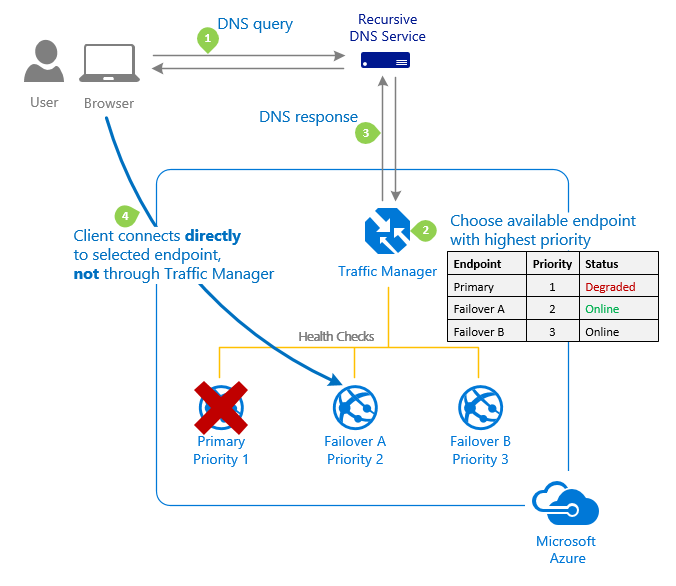
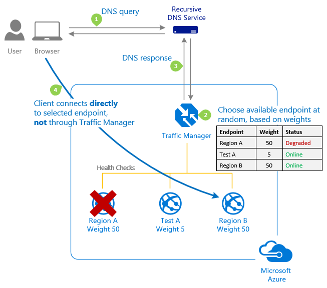
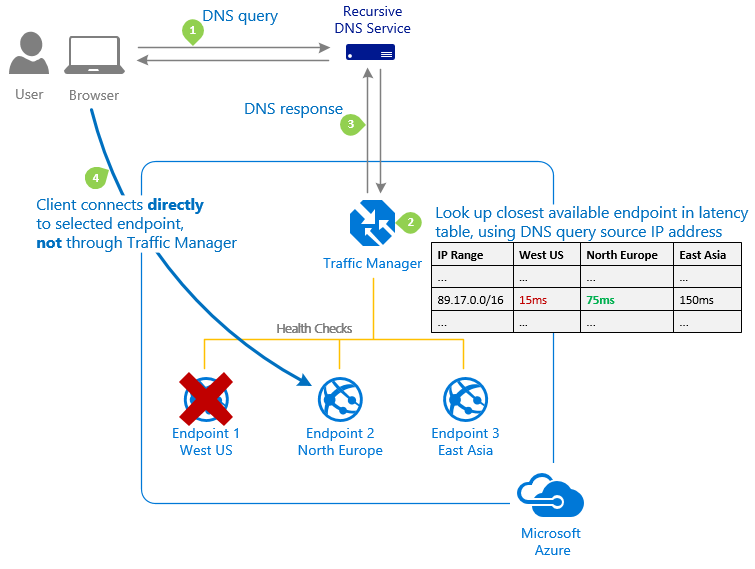
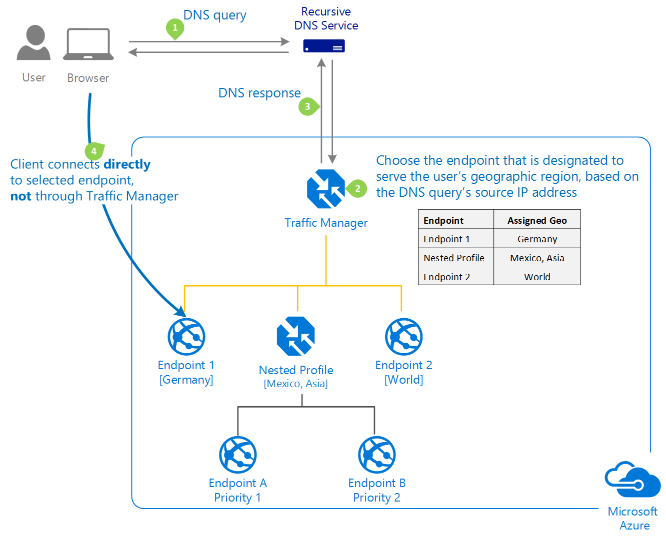

Profiles can be nested

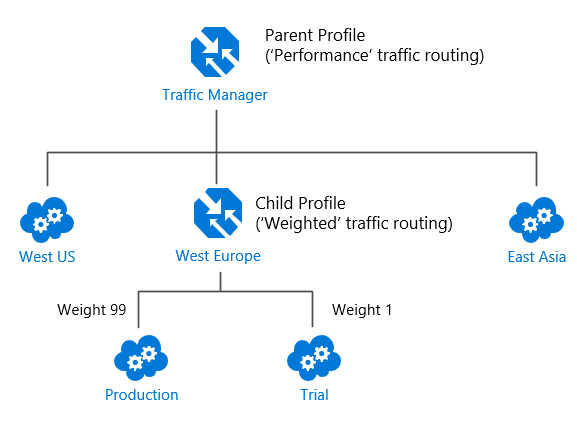

### Azure Application Gateway

Provides application delivery controller (ADC) as a service, offering various **Layer 7** load-balancing capabilities. Use it to optimize web farm productivity by **offloading** CPU-intensive **SSL termination** to the gateway.

Azure Application Gateway is a web traffic load balancer that enables you to manage traffic to your web applications. Traditional load balancers operate at the transport layer (OSI layer 4 - TCP and UDP) and route traffic based on source IP address and port, to a destination IP address and port.

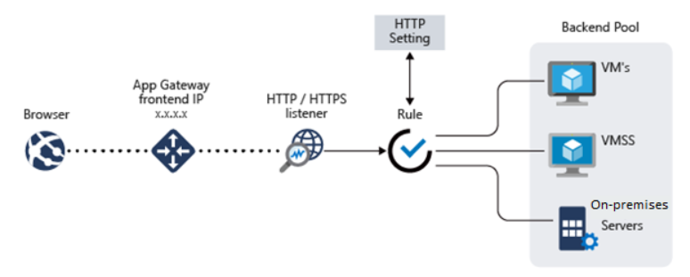  

### Azure Front Door

Application delivery network that provides **global** load balancing and site acceleration service for **web applications**. It offers **Layer 7** capabilities for your application like **SSL offload**, **path-based routing**, fast failover, caching, etc. to improve performance and high-availability of your applications.

## Global vs regional

**Global** load-balancing services distribute traffic across regional backends, clouds, or hybrid on-premises services. These services route end-user traffic to the closest available backend. They also react to changes in service reliability or performance, in order to maximize availability and performance. You can think of them as systems that load balance between application stamps, endpoints, or scale-units hosted across different regions/geographies.

In contrast, **Regional** load-balancing services distribute traffic within virtual networks across virtual machines (VMs) or zonal and zone-redundant service endpoints within a region. You can think of them as systems that load balance between VMs, containers, or clusters within a region in a virtual network.

## HTTP(S) vs non-HTTP(S)

**HTTP(S)** load-balancing services are Layer 7 load balancers that only accept HTTP(S) traffic. They are intended for web applications or other HTTP(S) endpoints. They include features such as SSL offload, web application firewall, path-based load balancing, and session affinity.

In contrast, **non-HTTP(S)** load-balancing services can handle non-HTTP(S) traffic and are recommended for non-web workloads.

## Summary

Service | Global/regional | Recommended traffic
---|---|---
Azure Front Door | Global | HTTP(S)
Traffic Manager | Global | non-HTTP(S)
Application Gateway | Regional | HTTP(S)
Azure Load Balancer | Regional | non-HTTP(S)

## Choosing a load balancing option

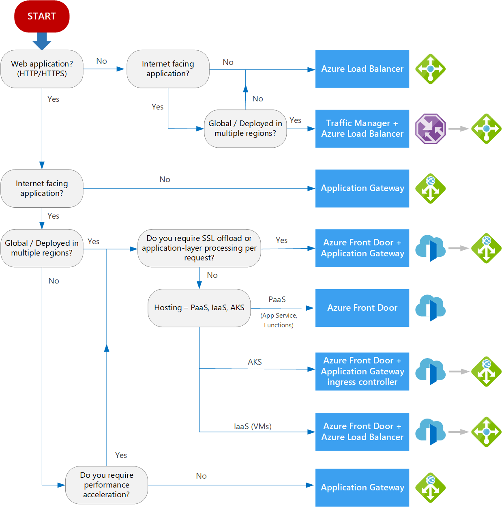