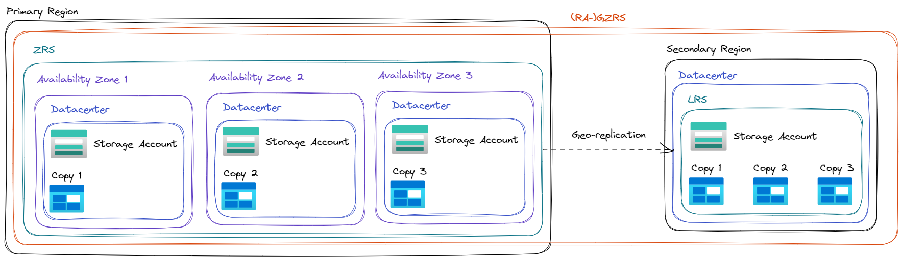

Azure Storage always stores multiple copies of your data so that it's protected from planned and unplanned events, including transient hardware failures, network or power outages, and massive natural disasters. Redundancy ensures that your storage account meets its availability and durability targets even in the face of failures.

## Redundancy Primary Region

Data in an Azure Storage account is always replicated three times in the primary region. Azure Storage offers two options for how your data is replicated in the primary region:

- LRS
- ZRS

### LRS

Copies your data **synchronously** three times within a single physical location in the primary region. LRS is the least expensive replication option, but isn't recommended for applications requiring high availability or durability.

### ZRS

Copies your data **synchronously** across three Azure availability zones in the primary region. For applications requiring high availability, Microsoft recommends using ZRS in the primary region, and also replicating to a secondary region.

## Redundancy Secondary Region

For applications requiring high durability, you can choose to additionally copy the data in your storage account to a secondary region that is hundreds of miles away from the primary region. If your storage account is copied to a secondary region, then your data is durable even in the case of a complete regional outage or a disaster in which the primary region isn't recoverable.

When you create a storage account, you select the primary region for the account. The paired secondary region is determined based on the primary region, and can't be changed.

Azure Storage offers two options for copying your data to a secondary region:

- GRS
- GZRS

> The primary difference between GRS and GZRS is how data is replicated in the primary region. Within the secondary region, data is always replicated synchronously three times using LRS. LRS in the secondary region protects your data against hardware failures.

### GRS

Copies your data synchronously three times within a single physical location in the primary region using LRS. It then copies your data asynchronously to a single physical location in the secondary region. Within the secondary region, your data is copied synchronously three times using LRS.

### GZRS

Copies your data synchronously across three Azure availability zones in the primary region using ZRS. It then copies your data asynchronously to a single physical location in the secondary region. Within the secondary region, your data is copied synchronously three times using LRS.

### Read access to data in the secondary region

Geo-redundant storage (with GRS or GZRS) replicates your data to another physical location in the secondary region to protect against regional outages. With an account configured for GRS or GZRS, data in the secondary region is not directly accessible to users or applications, unless a failover occurs. The failover process updates the DNS entry provided by Azure Storage so that the secondary endpoint becomes the new primary endpoint for your storage account. During the failover process, your data is inaccessible. After the failover is complete, you can read and write data to the new primary region.

If your applications require high availability, then you can configure your storage account for read access to the secondary region. When you enable read access to the secondary region, then your data is always available to be read from the secondary, including in a situation where the primary region becomes unavailable. Read-access geo-redundant storage (RA-GRS) or read-access geo-zone-redundant storage (RA-GZRS) configurations permit read access to the secondary region.

> Because data is replicated asynchronously from the primary to the secondary region, the secondary region is typically behind the primary region in terms of write operations. If a disaster were to strike the primary region, it's likely that some data would be lost.

## Summaries

### Durability and availability parameters

Parameter|LRS|ZRS|(RA-)GRS|(RA-)GZRS
---|---|---|---|---
Percent durability of objects over a given year	| at least 11 9's | at least 12 9's | at least 16 9's | at least 16 9's
Availability for read requests | At least 99.9% (99% for Cool or Archive access tiers) | At least 99.9% (99% for Cool or Archive access tiers) | At least 99.9% (99% for Cool or Archive access tiers) for GRS | At least 99.99% (99.9% for Cool or Archive access tiers) for RA-GRS
||||At least 99.9% (99% for Cool or Archive access tiers) for GZRS | At least 99.99% (99.9% for Cool or Archive access tiers) for RA-GZRS
Availability for write requests | At least 99.9% (99% for Cool or Archive access tiers) | At least 99.9% (99% for Cool or Archive access tiers) | At least 99.9% (99% for Cool or Archive access tiers) | At least 99.9% (99% for Cool or Archive access tiers)
Number of copies of data maintained on separate nodes | Three copies within a single region | Three copies across separate availability zones within a single region | Six copies total, including three in the primary region and three in the secondary region | Six copies total, including three across separate availability zones in the primary region and three locally redundant copies in the secondary region

### Durability and availability by outage scenario

Parameter|LRS|ZRS|(RA-)GRS|(RA-)GZRS
---|---|---|---|---
A node within a data center becomes unavailable | Yes | Yes | Yes | Yes
An entire data center (zonal or non-zonal) becomes unavailable | No | Yes | Yes | Yes
A region-wide outage occurs in the primary region | No | No | Yes | Yes
Read access to the secondary region is available if the primary region becomes unavailable | No | No | Yes (with RA-GRS) | Yes (with RA-GZRS)
