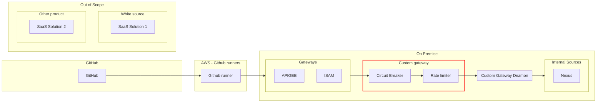
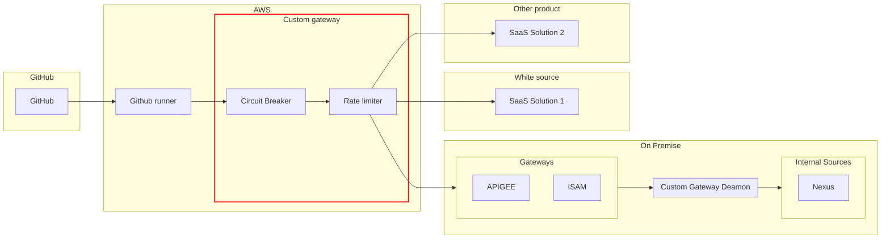

# 2023-12-14 Workshop Observability

Created: December 14, 2023 3:13 PM
Tags: Observability
Attendees: Arno Mijs (https://www.notion.so/Arno-Mijs-64532a2ed71546eca9da71acb7bfc6dd?pvs=21), Ben Elsen (https://www.notion.so/Ben-Elsen-7c9476b1c1714d2a86ebc9b894761850?pvs=21), Willem Schelstraete (https://www.notion.so/Willem-Schelstraete-ed3493b1dd964c3793fa4d5b4749ec1d?pvs=21), Niels Mampuys (https://www.notion.so/Niels-Mampuys-674a5ea4e858425681cfe38172d294e1?pvs=21)

# Circuit breaker / Rate Limiter

## Current state

They use the circuit braker internally, but only at applicative level, not as a component in the chain.

The solution we should bring should be route based, and work with the current reverse proxy ISAM.

Why use ISAM? The gateways make sure the 0-thrust policy is guarded and the zoning is maintained. Introducing a new gateway would meet with a lot of resistance within KBC

## Proposal

Have a circuit braker control to evaluate the self hosted tools, like nexus, sonar, jira,…

SaaS tools are currently out of scope, since they are most likely to be replaced with Github hosted variants.

When the circuit breaker goes open, it should pause the runners on github, so github can queue up the tasks and continue once the circuit braker is closed again.

The circuit braker can just retry the original message, since data on the network is cheaper then developing health checks

### Proposal 1

**Pro:**

- We are behind the firewall and as result in the correct zone
- We are in the direct line to the services, only the gateways need to change their target

**Con:**

- It is harder to include external sources
- Moving resources to the cloud might make this solution harder as well

### Proposal 2

**Pro:**

- Being closer to the runners will reduce latency
- Being in the same zone as the runners, should eliminate zoning issues

**Con:**

- We are going to have to move resource to azure once KBC switches to Github/Microsoft hosted runners
- We can’t include the self hosted mac runners
- We need to incorporate the proxy in all the actions

### Conclusion

We should investigate proposal 2 further, since that is the preferred way forward for Johan. Niels agreed with Johan his reasoning.

Some requirements that came up:

- When the circuit braker brakes, the jobs need to be paused
    - If the breaking job can’t be paused, investigate if we can requeue
- Configurations needs to be handled via config files with an IaC mindset
- Configurations needs to happen on tool level

# Observability

ELK is the preferred stack to use for observing the system.

Dashboards should be created with a top down mentality, where it is easy to drill down into the problems.

Dashboards should be created around certain important kpi

## KPI’s

- Average wait time for a build
- Average jobs in the queue
- number of failed builds, not caused by user mistake
    - failing tests
    - compiler errors
    - …
- Average latency to the tools
    - Confluence is an important one here
- Number of times admin for a day is requested

## Traceability

Guidelines will have to be created, so all the teams can log their output to the elk stack in a consistent way. This way we can have trace issues faster.

Preferably all actions are logged using the open telemetry standard

Data governance need to be taken into account here

## Hosting

Currently ELK is hosted on AWS and it will stay like that for the foreseeable future

# Bypassing 4-eyes principle

KBC has a Azure department that currently runs everything serverless. They are using Azure Functions for this, which is great, since this is what we had in mind for our solution

We will have to look at the coding standards for this solutions

# Varia

- Currently little to no experience with running containerized apps on Azure
- There are 2 plans for delivering the CB/RL solution
    - Xebia | Xpirit do the whole project and deliver it as a solution
    - Xebia | Xpirit aid in/oversee the development for the solution

# Remarks

- Since not all requests are web requests, the gateway for CB/RL should handle lower level connections
- If they switch to Github/Microsoft hosted runners, will we still be able to proxy everything over our gateway?
