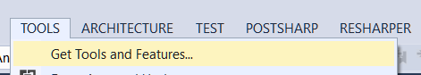
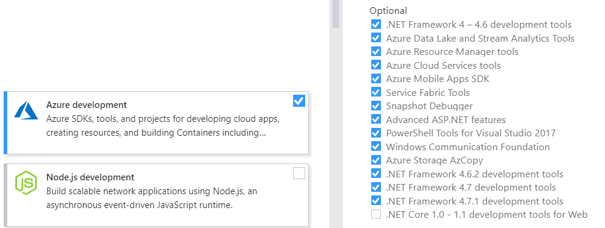
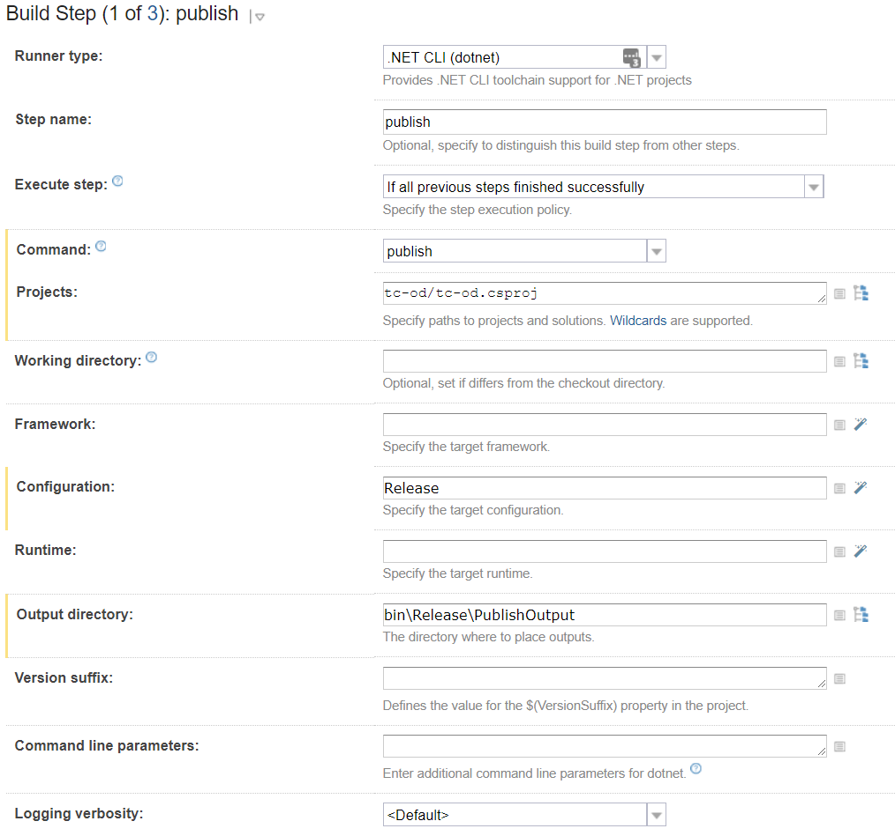
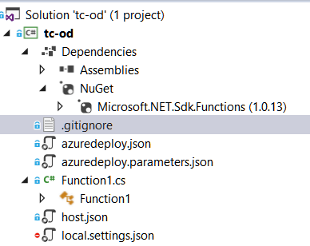

Following this note you will be able to Create, Build and Deploy a simple Azure Function App. You create it in Visual Studio. Let it build with Teamcity and deploy it with Octopus Deploy. The needed Azure Resources will also be deployed.

# Setup
## Tools

* Visual Studio 2017 v15.7.4 (VS).
* TeamCity v2017.2.4 (TC).
* Octopus Deploy v2018.6.2 (OD).

For this purpose I deployed a Azure VM using this [template] (https://portal.azure.com/#create/octopus.octopusdeployoctopus-deploy), installed an OD Tentacle, a TC Agent and OD cli (in `C:\Programs\Octo`). OD downloads can be found [here] (https://octopus.com/downloads). Also install the correct .NET version via this [link] (https://www.microsoft.com/web/downloads/platform.aspx) and set the DOTNET_HOME environment variable in TC to `C:\Program Files\dotnet\`

Make sure you have installed the Azure development workload in VS. Check via TOOLS\Get Tools and Features...


On Workloads tab check Azure development



# Create
We use VS for developing the Function. Store the project in a source control system supported by TC.

## Function
Add new Project, search for Azure Functions and give it a name. It is a basic http trigger. Nothing fancy. Modify if needed.

Install Nuget package `Microsoft.NET.Sdk.Functions`.

## ARM Template
Deploying an Azure Function needs 3 Azure Resources:

* Storage Account (Microsoft.Storage/storageAccounts)
* Hosting Plan (Microsoft.We<span>b/serverfarms)
* Function App (Microsoft.We<span>b/sites)

Below you will find a basic ARM Template with these 3 resources and a parameters Template. Set Copy to Output Directory to `Copy if Newer`. Add those templates to your project and name them azuredeploy.json and azuredeploy.parameters.json.

The project structure should look like
    


### Template
````json
    {
      "$schema": "https://schema.management.azure.com/schemas/2015-01-01/deploymentTemplate.json#",
      "contentVersion": "1.0.0.0",
      "parameters": {
        "appName": {
          "type": "string",
          "metadata": {
            "description": "The name of the function app that you wish to create."
          }
        },
        "sku": {
          "type": "string",
          "allowedValues": [
            "Free",
            "Shared",
            "Basic",
            "Standard"
          ],
          "defaultValue": "Standard",
          "metadata": {
            "description": "The pricing tier for the hosting plan."
          }
        },
        "workerSize": {
          "type": "string",
          "allowedValues": [
            "0",
            "1",
            "2"
          ],
          "defaultValue": "0",
          "metadata": {
            "description": "The instance size of the hosting plan (small, medium, or large)."
          }
        },
        "storageAccountType": {
          "type": "string",
          "defaultValue": "Standard_LRS",
          "allowedValues": [
            "Standard_LRS",
            "Standard_GRS",
            "Standard_RAGRS"
          ],
          "metadata": {
            "description": "Storage Account type"
          }
        },
        "location": {
          "type": "string",
          "defaultValue": "[resourceGroup().location]",
          "metadata": {
            "description": "Location for all resources."
          }
        }
      },
      "variables": {
        "functionAppName": "[parameters('appName')]",
        "hostingPlanName": "[parameters('appName')]",
        "storageAccountName": "[concat(uniquestring(resourceGroup().id), 'functions')]"
      },
      "resources": [
        {
          "type": "Microsoft.Storage/storageAccounts",
          "name": "[variables('storageAccountName')]",
          "apiVersion": "2016-12-01",
          "location": "[parameters('location')]",
          "kind": "Storage",
          "sku": {
            "name": "[parameters('storageAccountType')]"
          }
        },
        {
          "type": "Microsoft.Web/serverfarms",
          "apiVersion": "2015-04-01",
          "name": "[variables('hostingPlanName')]",
          "location": "[parameters('location')]",
          "properties": {
            "name": "[variables('hostingPlanName')]",
            "sku": "[parameters('sku')]",
            "workerSize": "[parameters('workerSize')]",
            "hostingEnvironment": "",
            "numberOfWorkers": 1
          }
        },
        {
          "apiVersion": "2015-04-01",
          "type": "Microsoft.Web/sites",
          "name": "[variables('functionAppName')]",
          "location": "[parameters('location')]",
          "kind": "functionapp",
          "properties": {
            "name": "[variables('functionAppName')]",
            "serverFarmId": "[resourceId('Microsoft.Web/serverfarms', variables('hostingPlanName'))]",
            "hostingEnvironment": "",
            "clientAffinityEnabled": false,
            "siteConfig": {
              "alwaysOn": true
            }
          },
          "dependsOn": [
            "[resourceId('Microsoft.Web/serverfarms', variables('hostingPlanName'))]",
            "[resourceId('Microsoft.Storage/storageAccounts', variables('storageAccountName'))]"
          ],
          "resources": [
            {
              "apiVersion": "2016-03-01",
              "name": "appsettings",
              "type": "config",
              "dependsOn": [
                "[resourceId('Microsoft.Web/sites', variables('functionAppName'))]",
                "[resourceId('Microsoft.Storage/storageAccounts', variables('storageAccountName'))]"
              ],
              "properties": {
                "AzureWebJobsStorage": "[concat('DefaultEndpointsProtocol=https;AccountName=',variables('storageAccountName'),';    AccountKey=',listkeys(resourceId('Microsoft.Storage/storageAccounts', variables('storageAccountName')),     '2015-05-01-preview').key1,';')]",
                "AzureWebJobsDashboard": "[concat('DefaultEndpointsProtocol=https;AccountName=',variables('storageAccountName'),';    AccountKey=',listkeys(resourceId('Microsoft.Storage/storageAccounts', variables('storageAccountName')),     '2015-05-01-preview').key1,';')]",
                "FUNCTIONS_EXTENSION_VERSION": "~1"
              }
            }
          ]
        }
      ]
    }
````

### Parameters
````json
    {
      "$schema": "https://schema.management.azure.com/schemas/2015-01-01/deploymentParameters.json#",
      "contentVersion": "1.0.0.0",
      "parameters": {
        "appName": {
          "value": "#{AzureFunctionName}"
        }
      }
    }
````
# Build
In TC Create a new project, add a new Build Configuration with 3 Build Steps.


## Parameters
These are use in TC in scripts, variable names, ...
* apikey (generated in OD)
* packageId (`tc-od`)
* server (url to OD)
* version (semantic version nr like `1.0.%build.number%`)

## publish
This runner type is .NET CLI (dotnet). Give a Step name. Choose publish as Command. Select the project. Set Configuration and Output directory to bin\Release\PublishOutput


## pack
This runner type is Command Line. Give a Step name. Choose Custom script and enter script below.

```batch
cd tc-od\bin\Release\PublishOutput
C:\Programs\Octo\octo pack --id=%packageId% --format=zip --outFolder=../dist --version=%version%
```

## push
This runner type is Command Line. Give a Step name. Choose Custom script and enter script below.

This pushed the zip file to OD.

```batch
cd tc-od\bin\Release\dist
C:\Programs\Octo\octo push --server=%server% --apiKey=%apikey% --package=%packageId%.%version%.zip
```

# Deploy
In OD make sure you have setup

* an Environment
* a Deployment target(in our case a Azure Web App)
* a Lifecycle with automatic deploy after release creation
* an Azure Subscription (this is needed to deploy)

Add a project.

Under Process add 2 steps:

* Deploy Resources
* Deploy Function

## Deploy Resources
In this step we deploy the ARM template.

Search for `resource Group` and select Deploy an Azure resource Group.

* Set Step Name
* Select Execution Plan
* Select an Azure Account and Resource Group
* Select File inside a package
* Select Package
* Set Paths

## Deploy Function
In this step we deploy the Function.

Search for `azure web` and select Deploy an Azure Web App.

* Set Step Name
* Select Package

This is it. Happy coding!

# Resources

* https://octopus.com/blog/azure-functions