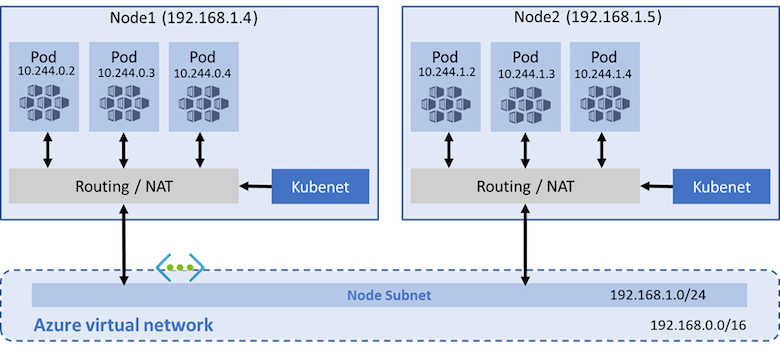
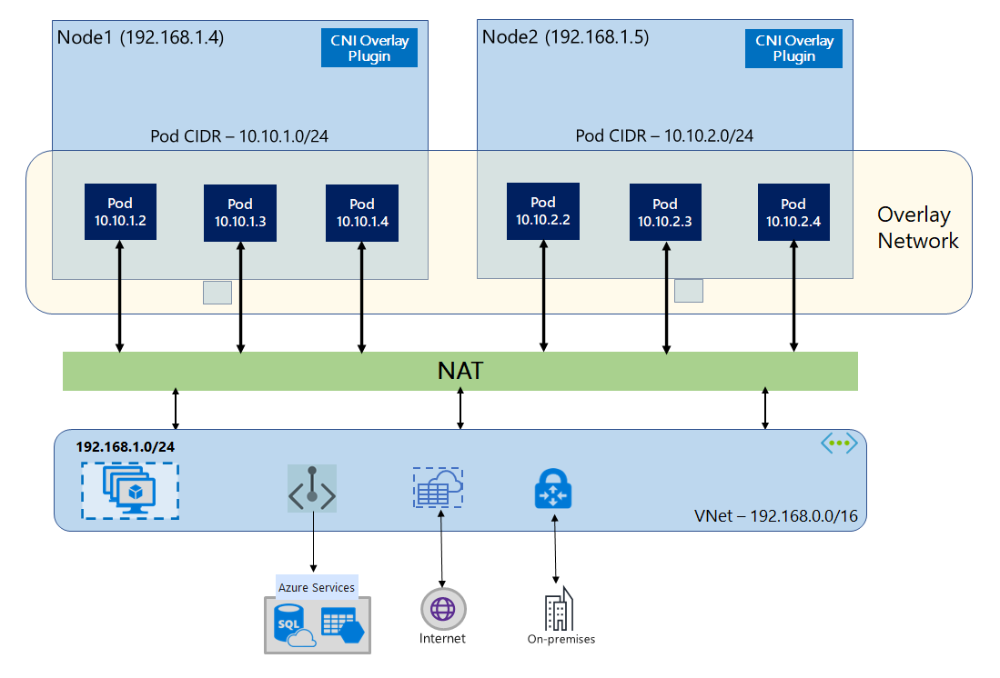

+++
title = '🌐 Demystifying Networking in Azure Kubernetes Service (AKS)'
slug = 'aks-networking-guide'
date = '2025-04-17 06:00:00Z'
draft = false
tags = ["Azure", "AKS", "Networking", "Azure CNI", "Cilium", "Cloud Networking", "Kubenet"]
categories = ["Azure", "Cloud Infrastructure", "Kubernetes"]
series = [ ]
layout = 'single'
[params]
  cover = true
  author = 'sujith'

description = "Explore networking models in Azure Kubernetes Service including Azure CNI, Overlay, Kubenet, and Azure CNI powered by Cilium, along with key updates and best practices."
+++

## Demystifying Networking in Azure Kubernetes Service (AKS)

Networking in Azure Kubernetes Service (AKS) provides the backbone for secure and efficient containerized workloads. Microsoft offers several networking models in AKS, each tailored for specific requirements and use cases. In this post, we explore these networking options: Azure CNI, Azure CNI Overlay, Kubenet, and Azure CNI powered by Cilium, along with recent updates from Azure.

### Kubenet

Kubenet is a simple and traditional networking approach in AKS, suitable for scenarios that don’t require the advanced networking features of Azure CNI.

**Highlights:**

- Pods receive IPs from a logically different IP range separate from the node's IP range.
- Supports basic network segmentation and routing.
- Lower complexity compared to Azure CNI, suitable for simpler environments.

[Configure Kubenet networking →](https://learn.microsoft.com/en-us/azure/aks/configure-kubenet)



On 31 March 2028, kubenet networking for Azure Kubernetes Service (AKS) will be retired.

After this date, you will not be able to create new AKS clusters with kubenet networking. Existing clusters will continue to work, but you will not be able to create new node pools with kubenet networking. You can migrate existing clusters to Azure CNI or Azure CNI Overlay.

For more information, see [Kubenet retirement announcement](https://azure.microsoft.com/en-us/updates?id=485172).

For more information on how to migrate your existing clusters to Azure CNI or Azure CNI Overlay, see [Migrate from kubenet to Azure CNI](https://learn.microsoft.com/en-us/azure/aks/configure-azure-cni).

For more information on how to migrate your existing clusters to Azure CNI Overlay, see [Migrate from kubenet to Azure CNI Overlay](https://learn.microsoft.com/en-us/azure/aks/azure-cni-overlay).

For more information on how to migrate your existing clusters to Azure CNI powered by Cilium, see [Migrate from kubenet to Azure CNI powered by Cilium](https://learn.microsoft.com/en-us/azure/aks/azure-cni-powered-by-cilium).



### Azure CNI

Azure Container Networking Interface (CNI) provides direct integration with Azure's virtual networking capabilities. Each pod gets its own IP address within your virtual network, enabling seamless connectivity across your Azure resources.

**Key benefits:**

- Direct IP addressing from your Azure VNet.
- Simplified communication with other Azure resources without NAT.
- Ideal for applications requiring high-speed networking and tight integration.

[Learn how to configure Azure CNI →](https://learn.microsoft.com/en-us/azure/aks/configure-azure-cni?tabs=configure-networking-portal)

### Azure CNI Overlay

Azure CNI Overlay enhances the traditional Azure CNI model by allowing pods to utilize IP addresses from a private overlay network. This approach dramatically increases IP address availability, addressing scaling challenges.

**Key features:**

- Separate pod CIDR ranges, conserving IP space in your primary VNet.
- Ideal for large-scale clusters with extensive pod requirements.
- Easy integration alongside existing Azure infrastructure.

[Explore Azure CNI Overlay configuration →](https://learn.microsoft.com/en-us/azure/aks/azure-cni-overlay?tabs=kubectl)

### Azure CNI Powered by Cilium

Azure CNI powered by Cilium combines the robust networking capabilities of Azure CNI with Cilium's advanced networking and security features. This includes rich observability, enhanced security through eBPF-based filtering, and improved network policy enforcement.

**Advantages:**

- Enhanced security features and detailed observability.
- Policy enforcement at Layer 3/4 and Layer 7.
- High-performance networking with eBPF.

[Learn more about Azure CNI powered by Cilium →](https://learn.microsoft.com/en-us/azure/aks/azure-cni-powered-by-cilium)

### Conclusion

Choosing the right networking solution for your AKS clusters depends heavily on your application's scalability, security, and integration requirements. Azure's diverse networking models, including Azure CNI, Azure CNI Overlay, Kubenet, and Azure CNI powered by Cilium, offer flexibility to address various scenarios, from simple setups to highly complex, secure environments. Staying updated with Azure’s continuous improvements ensures that your clusters remain performant, scalable, and secure.
