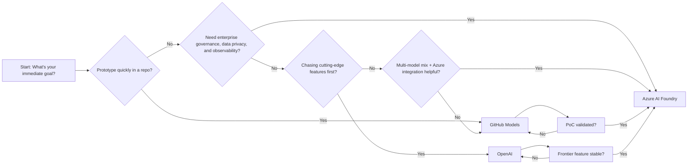
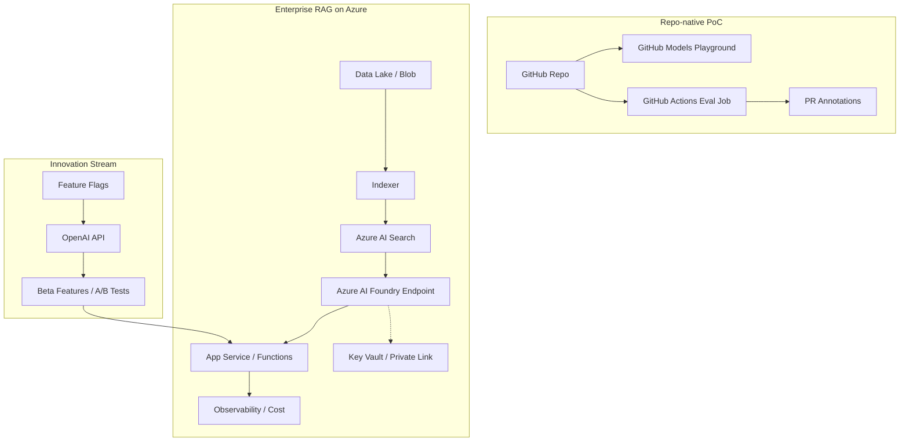

+++
title = '🤖 When to Use GitHub Models, Azure AI Foundry, and OpenAI'
slug = 'when-to-use-github-models-azure-ai-foundry-openai'
date = '2025-09-23 06:00:00Z'
lastmod = '2025-09-23 06:00:00Z'
draft = false
tags = ['AI', 'GitHub Models', 'Azure AI Foundry', 'OpenAI', 'Enterprise AI', 'Developer Productivity']
categories = ['AI Platforms', 'Cloud', 'Development']
series = ['AI Decision Guides']

layout = 'single'
[params]
    cover = true
    author = "sujith"
    cover_prompt = '''
    An abstract illustration of three branching paths representing GitHub Models, Azure AI Foundry, and OpenAI, with developers on one side and enterprises on the other, choosing their journey in AI.
    '''
description = 'A practical guide on when to use GitHub Models, Azure AI Foundry, and OpenAI. Covers both developer and enterprise perspectives, with comparisons and recommendations for prototyping, production, and innovation.'
+++

## 🤖 When to Use GitHub Models, Azure AI Foundry, and OpenAI

Artificial intelligence is moving fast, and so are the platforms that deliver it.  
For many teams, the question isn’t *“Can we use AI?”* but *“Where should we use it from?”*

Between **GitHub Models**, **Azure AI Foundry**, and **OpenAI**, developers and enterprises alike face an abundance of choice. The reality is that there is no single “best” option — the right one depends on your perspective and your stage in the AI journey.

This guide takes a **neutral look** at when to use each option, from both the **developer’s lens** (speed, simplicity, integration) and the **enterprise lens** (compliance, governance, scalability).

---

### 🌐 The Options at a Glance

- **GitHub Models**  
  A selection of models available directly in GitHub. Perfect for prototyping, experimenting, and enhancing workflows inside repositories. Integrated with GitHub Copilot and Actions.

- **Azure AI Foundry (formerly Azure AI Studio)**  
  A full-featured platform for building, evaluating, deploying, and governing AI solutions. Enterprise-grade, with compliance, monitoring, and integration into the wider Azure ecosystem. Supports multiple foundation models, both proprietary and open source.

- **OpenAI**  
  Direct access to OpenAI’s cutting-edge models (e.g., GPT-4, o1, DALL·E, Whisper). Typically the first place to see new features and capabilities. Lightweight to get started, but less focused on governance out of the box.

---

### 🧭 Visual Decision Map

*Alt text: Start with your goal. If you need fast repo-native prototyping, choose GitHub Models. If governance and integration matter, choose Azure AI Foundry. If you need frontier features, use OpenAI — and migrate to Foundry once stable.*

---

### ⚖️ Comparison by Perspective

AI platforms look different depending on whether you are a **developer** or an **enterprise decision-maker**.  
Here’s how the three compare across both views:

| Criteria | GitHub Models | Azure AI Foundry | OpenAI |
|----------|---------------|------------------|--------|
| **Developer View** | Quick prototyping inside GitHub. Easy to switch models. | More setup overhead, but powerful integrations with data and apps. | Fastest access to the latest features and frontier models. |
| **Enterprise View** | Suitable for PoCs and hackathons, but limited governance. | Enterprise-ready with compliance, monitoring, and Responsible AI tooling. | Innovation-friendly, but weaker on data residency and enterprise controls. |

---

### 🧑‍💻 Developer Perspective

**Priorities:** speed, integration, flexibility.

**GitHub Models**  

- Test prompts and models directly in your repo.  
- Zero infra to start; ideal for summarizing PRs, generating docs, or experimenting with RAG approaches on public data.  
- Swap models easily without vendor lock-in during early exploration.

**Azure AI Foundry**  

- Adds evaluations, safety filters, and deployment endpoints.  
- Integrates with Azure services (Search, Key Vault, Functions, Container Apps) to build full stacks.  
- Useful when prototypes must touch enterprise data or scale behind private networks.

**OpenAI**  

- Great for trying new reasoning/multimodal/agent features.  
- Simple APIs and SDKs to build quick demos or SaaS features.  
- Consider a path to bring workloads under enterprise control later.

---

### 🏢 Enterprise Perspective

**Priorities:** security, compliance, cost governance, reliability.

**GitHub Models**  

- Excellent for hackathons and ideation, but not a production landing zone.  
- Encourage developers to validate feasibility here before requesting infra.

**Azure AI Foundry**  

- Strongest option for regulated workloads.  
- Regional hosting, network isolation, and observability out of the box.  
- Built-in Responsible AI: monitoring, content filters, human-in-the-loop patterns, and auditability.  
- Supports multi-model strategies and gradual model replacement.

**OpenAI**  

- Perfect for innovation labs and customer pilots where cutting-edge matters.  
- Requires additional guardrails for data residency, privacy, and DLP if used for sensitive data.  
- Keep a governance plan for model/version drift.

---

### 🔄 A Pragmatic Hybrid Journey

1) **Prototype** with *GitHub Models* — move fast, learn, de-risk ideas.  
2) **Scale & Govern** with *Azure AI Foundry* — secure data, monitor, and control costs.  
3) **Innovate** with *OpenAI* — scout frontier capabilities and feed learnings back into the roadmap.

**Why this works:** it aligns developer speed with enterprise safety without stalling either side.

---

### 🧩 Architecture Patterns (High-Level)

- **Repo-native PoC** → GitHub Actions triggers evaluation jobs; results posted to PRs.  
- **Enterprise RAG** → Azure AI Search + Azure AI Foundry endpoints + Key Vault for secrets + Private Link.  
- **Hybrid Innovation** → Feature toggles to call OpenAI for specific capabilities while the core runs on Foundry.

---

### 🧪 Evaluation & Responsible AI

- Define success metrics early (latency, accuracy, refusal rate, cost per request).  
- Run red-team tests for prompt injection, data leakage, and jailbreaks.  
- Track model and prompt versions; compare with A/B or interleaving tests.  
- Document known limitations and fallback behaviors.

---

### 💰 Cost & Operations

- **Shift-left on costing:** estimate cost-per-call × expected volume; include embedding/search costs in RAG.  
- **Right-size deployments:** autoscale endpoints; cache results; batch long-running jobs.  
- **Observability:** centralize logs, traces, and evaluations; alert on anomaly spikes.  
- **FinOps:** tag resources by team/project; review idle endpoints monthly.

---

### ✅ Conclusion

The question of whether to use **GitHub Models, Azure AI Foundry, or OpenAI** doesn’t have a one-size-fits-all answer. It depends on context, audience, and maturity.

- **GitHub Models = Idea Lab** → fast, frictionless prototyping.  
- **Azure AI Foundry = AI Factory** → enterprise-grade deployment with governance.  
- **OpenAI = Innovation Hub** → cutting-edge experimentation.

For developers, start small and iterate quickly.  
For enterprises, invest in governance and scale responsibly.  
Together, both views create a pathway from *exploration → production → innovation*
