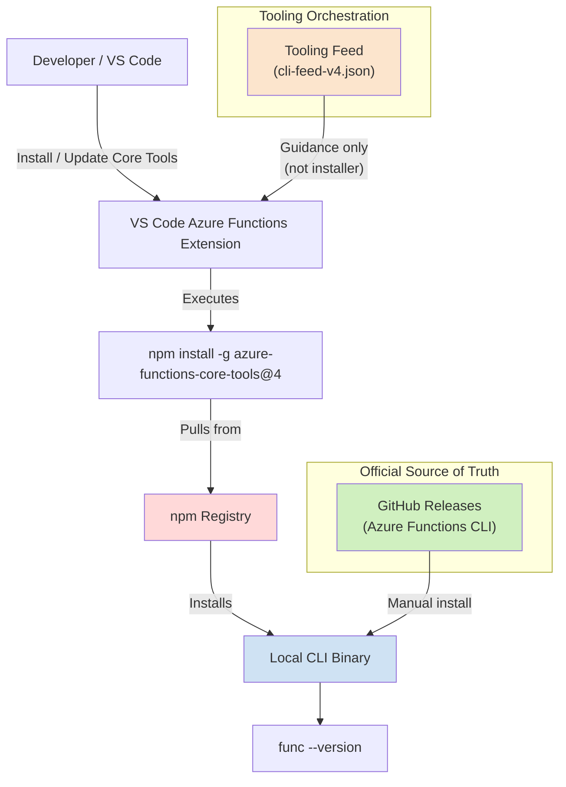
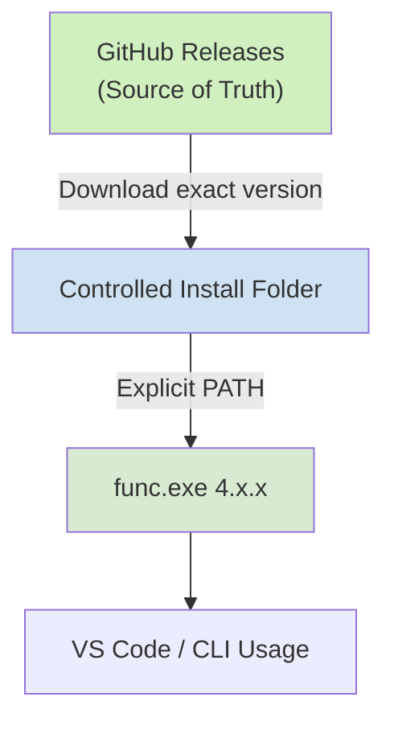

+++
title = '⚙️ Azure Functions Core Tools: Version Mismatch'
slug = 'azure-functions-core-tools-version-mismatch'
date = '2026-04-23 11:30:00Z'
lastmod = '2026-04-23 11:30:00Z'
draft = false
tags = [
  "Azure",
  "Azure Functions",
  "CLI",
  "Developer Productivity",
  "DevOps",
  "Troubleshooting"
]
categories = [
  "Azure",
  "DevOps",
  "Troubleshooting"
]
series = [
  "Developer Pitfalls"
]

layout = "single"
[params]
    cover = true
    author = "sujith"
    cover_prompt = '''Create a clean technical illustration showing multiple installation paths for a CLI tool colliding. Visualise 3 pipelines: "npm", "Visual Studio Feed", and "Manual Install" all pointing to different versions of the same executable. Highlight a final decision node labelled "PATH" that selects one path. Use a dark theme with neon blue and orange lines, and include a terminal window showing mismatched versions (e.g. 4.125.0 vs 4.7.0). Target audience: senior developers and DevOps engineers.'''

description = "Azure Functions Core Tools version mismatch explained. Why VS Code, Visual Studio, npm, and PATH lead to inconsistent versions: how to fix it deterministically."
+++

## Azure Functions Core Tools: Why Your Version Is “Wrong” (and How to Fix It)

If you’ve worked with Azure Functions locally, chances are you’ve hit this:

```bash
func --version → 4.7.0
```

Even though you just installed:

```bash
npm install -g azure-functions-core-tools@4.9.0
```

Or Visual Studio shows something like:

```text
Releases\4.125.0
```

…and now nothing makes sense.

This is not a bug.  
This is a **system design issue**.

***

## The problem: there is no single “source of truth”

Azure Functions Core Tools is distributed through **multiple independent channels**:

| Source                     | What it represents                     |
| -------------------------- | -------------------------------------- |
| GitHub Releases            | ✅ Actual CLI binaries                  |
| npm                        | ⚠️ Packaged distribution               |
| Visual Studio tooling feed | ⚠️ Ecosystem version (not CLI version) |
| MSI install                | ❌ Global system install                |

Each of these can install a different version, and all can coexist on the same machine.

***

## The real root cause: PATH decides everything

No matter how many versions you install, Windows executes **only one**:

> 💡 The first `func.exe` found in your PATH

Example:

```powershell
Get-Command func
```

Output:

```text
C:\Program Files\Microsoft\Azure Functions Core Tools\func.exe (4.7.0)
```

👉 That’s it. That’s the one being used.

Everything else you installed is ignored.

***

## The confusion multiplies: Visual Studio vs VS Code

### VS Code

*   Uses **npm internally**
*   You see logs like:

```bash
npm install -g azure-functions-core-tools@4
```

✅ Transparent  
⚠️ Not deterministic

***

### Visual Studio

*   Uses **tooling feed (cli-feed-v4.json)**
*   Downloads silently to:

```text
%LOCALAPPDATA%\AzureFunctionsTools\Releases\
```

✅ Feels “managed”  
❌ No logging  
❌ Not obvious

***

## The most confusing part: fake version numbers

You might see:

```text
C:\Users\...\AzureFunctionsTools\Releases\4.125.0
```

And expect:

```text
func → 4.125.0
```

But instead:

```text
func → 4.7.0
```

👉 Why?

Because:

*   `4.125.0` = tooling bundle version
*   `4.7.0` = actual CLI version

These are **completely different version systems**.

***

## The full architecture (simplified)



***

## Real-world example (what happened)

A typical “broken” state:

*   Installed via npm → expected 4.9.0 ✅
*   Visual Studio installed → 4.125.0 bundle ✅
*   Global MSI → 4.7.0 ❌

Result:

```bash
func --version → 4.7.0
```

👉 Because:

```text
C:\Program Files\Microsoft\Azure Functions Core Tools\
```

wins in PATH.

***

## The fix: make it deterministic

### Step 1: find what is actually used

```powershell
Get-Command func
```

***

### Step 2: remove conflicting installs

*   Uninstall MSI version (Program Files)
*   Optionally:

```powershell
npm uninstall -g azure-functions-core-tools
Remove-Item "$env:LOCALAPPDATA\AzureFunctionsTools" -Recurse -Force
```

***

### Step 3: install a known-good version

👉 Recommended:

*   Download from GitHub Releases
*   Extract to:

```text
C:\tools\func-4.9.0
```

***

### Step 4: control PATH

```powershell
setx PATH "C:\tools\func-4.9.0;%PATH%"
```

***

### Step 5: verify

```powershell
func --version
```

✅ Expected:

```text
4.9.0
```

***

## Key takeaways

### 🔹 1. Multiple install mechanisms = multiple truth sources

There is no unified versioning or installer.

***

### 🔹 2. Visual Studio and VS Code behave fundamentally differently

*   VS Code → npm
*   Visual Studio → tooling feed

***

### 🔹 3. PATH is the hidden decision engine

> The version you run is not the version you installed.  
> It’s the version that wins PATH.

***

### 🔹 4. Tooling versions ≠ CLI versions

```text
4.125.0 ≠ 4.12.5 ≠ 4.7.0
```

👉 They belong to different versioning layers.

***

## Recommended enterprise approach

For regulated environments (e.g. banking):

✅ Install from GitHub releases  
✅ Pin version  
✅ Control PATH explicitly  
✅ Avoid npm / IDE-managed installs





***

## One-liner summary

> Azure Functions Core Tools is not broken: it’s just multi-source, multi-version, and PATH-driven.