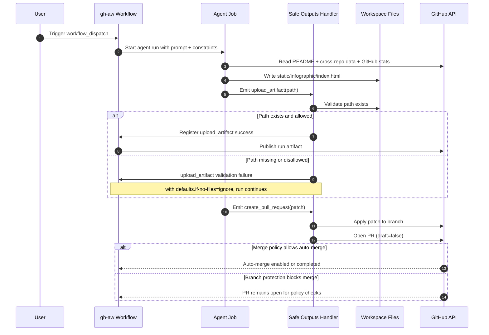

+++
title = '🛠️ Agentic Infographic Workflow Postmortem'
slug = 'agentic-infographic-workflow-postmortem'
date = '2026-04-28 21:30:00Z'
lastmod = '2026-04-28 21:30:00Z'
draft = false
tags = [
  "GitHub",
  "GitHub Actions",
  "GitHub Copilot",
  "Agentic Workflows",
  "Troubleshooting",
  "DevOps",
  "Automation"
]
categories = [
  "GitHub",
  "DevOps",
  "Troubleshooting"
]
series = [
  "GitHub Updates"
]

layout = "single"
[params]
    cover = true
    author = "sujith"
    cover_prompt = '''Create a technical postmortem illustration for an agentic GitHub Actions workflow.
    Show a pipeline with stages labelled compile, agent, safe outputs, artifact, and pull request.
    Add red and green status indicators to visualise failures and fixes over time.
    Include callouts for path mismatch, staging directory empty, API proxy unhealthy, and strict mode permissions.
    End with a stabilised final state writing to static/infographic/index.html.
    Use a professional engineering style with dark graphite background, cyan and amber accents, and clean schematic lines.
    Keep the layout enterprise-ready, clear, and focused on reliability debugging.'''

description = "How I built and debugged an agentic GitHub workflow for a PLG infographic, including every failure, root cause, and fix."
+++

I recently built an agentic GitHub Actions workflow to generate a static PLG
infographic from multiple public data sources and open a pull request with the
output.

It worked eventually, but only after a sequence of failures that were useful to
analyse. This post documents exactly how the workflow was created, what broke,
and how each issue was resolved.

## What the workflow was meant to do

The goal was simple:

1. Collect profile data from multiple sources.
2. Generate one static HTML infographic.
3. Upload it as a workflow artifact.
4. Open a pull request with the generated file.

The final output path is:

- `static/infographic/index.html`

## Data sources used

The workflow pulls data from:

- Repository README in `sujithq/sujithq.github.io`
- GitHub profile README in `sujithq/sujithq`
- Microsoft Learn transcript JSON in `sujithq/ms-learn`
- GitHub API stats for `sujithq`
- Optional data from `andrediasbr/github-certification-ranking`

Cross-repo reads were enabled via `tools.github.allowed-repos`.

## Initial workflow shape

The workflow was built with gh-aw front matter plus safe outputs:

- `upload-artifact` for exposing generated HTML
- `create-pull-request` for controlled write operations
- `threat-detection` to block unsafe active content

The HTML was intentionally constrained to be static:

- Inline CSS only
- No JavaScript
- No external assets
- No forms, iframes, or tracking

## Failure timeline and resolutions

### 1) Compilation and lock-file churn

**Symptom**:
Early iterations had compile and lock file consistency issues.

**Root cause**:
Workflow markdown changes were not always followed by a fresh compile.

**Resolution**:
Run `gh aw compile .github/workflows/plg-infographic-github.md` after each
material change, then keep the lock file in sync.

### 2) Threat detection false positives

**Symptom**:
Safe output checks flagged benign HTML/CSS output.

**Root cause**:
Default detection was too generic for this static page use case.

**Resolution**:
Customised `safe-outputs.threat-detection.prompt` to explicitly allow plain
layout/styling and only flag active or risky web behaviour.

### 3) Transient platform instability

**Symptom**:
Several runs failed with `awf-api-proxy unhealthy`.

**Root cause**:
Infrastructure-level transient issue, not workflow logic.

**Resolution**:
Rerun. No workflow code fix was required for this specific error.

### 4) Artifact upload path mismatch

**Symptom**:
`upload_artifact` failed with `no files matched`.

**Root cause**:
The agent generated the file as `docs/infographic.html` but called
`upload_artifact` with `infographic.html`.

**Resolution**:
Allowed both paths in `safe-outputs.upload-artifact.allowed-paths` and made the
upload instruction explicit about valid paths.

### 5) Staging directory empty

**Symptom**:
Safe outputs failed with:
`path does not exist in staging directory`.

**Root cause**:
Artifact upload expected a staged file, but the staging directory was empty at
validation time.

**Resolution**:
Set:

```yaml
safe-outputs:
  upload-artifact:
    staged: false
    defaults:
      if-no-files: ignore
```

This avoids hard failure for missing staged files and reads from workspace path
instead.

### 6) Output location change request

**Symptom**:
The output was initially under `docs/` but needed to live under `static/`.

**Resolution**:
Updated all relevant fields from `docs/infographic.html` to
`static/infographic/index.html`:

- `metadata.outputs`
- generation instructions
- artifact allow-list
- PR guidance

### 7) Merge model expectation mismatch

**Symptom**:
Need was to merge automatically, ideally direct to `main`.

**Root cause**:
gh-aw strict mode blocks write permissions such as `contents: write`, and safe
output model is designed around controlled PR creation.

**Resolution**:
- Keep PR creation non-draft.
- Request auto-merge where possible.
- Accept that direct write to `main` is not supported in strict mode agentic
  workflow.

## Final working configuration highlights

The stable setup now includes:

- `create-pull-request` with `draft: false`
- `upload-artifact` with `staged: false`
- `upload-artifact.defaults.if-no-files: ignore`
- allow-listed artifact path `static/infographic/index.html`
- threat-detection prompt tuned for static HTML/CSS output
- expanded data source instructions and GitHub API stats requirements

## Practical lessons learned

1. Treat path handling as first-class design: generation path, artifact path,
   and allow-list must align exactly.
2. Distinguish transient platform faults from configuration faults before
   changing code.
3. In gh-aw strict mode, design around safe outputs and PR flows, not direct
   repository writes.
4. If output must always be visible, configure artifact handling to fail safely
   and avoid brittle staging assumptions.
5. Keep compile and lock-file generation in the tight edit loop.

## Suggested validation checklist

Before each run:

- Confirm output target path is `static/infographic/index.html` everywhere.
- Confirm `allowed-repos` includes every cross-repo source.
- Confirm lock file is freshly compiled.
- Confirm safe output upload path is allow-listed.
- Confirm PR mode is non-draft if downstream automation expects merge.

## Workflow sequence diagram

The sequence below shows how the agent run, safe outputs, artifact processing,
and PR creation interact, including the path checks that caused previous
failures.



## References

- [GitHub Actions documentation](https://docs.github.com/actions)
- [GitHub REST API documentation](https://docs.github.com/rest)
- [Microsoft Learn profile transcript](https://learn.microsoft.com/en-us/users/sujithquintelier/transcript/71pnqhwmx5xn8ww)

## Recap

This workflow succeeded once each failure mode was isolated and treated as a
separate class of problem: compile hygiene, safe output validation, runtime
transients, path contracts, and platform security constraints.

The result is a more reliable agentic pipeline that generates a static
infographic from live data sources with controlled repository writes through a
PR-first model.
