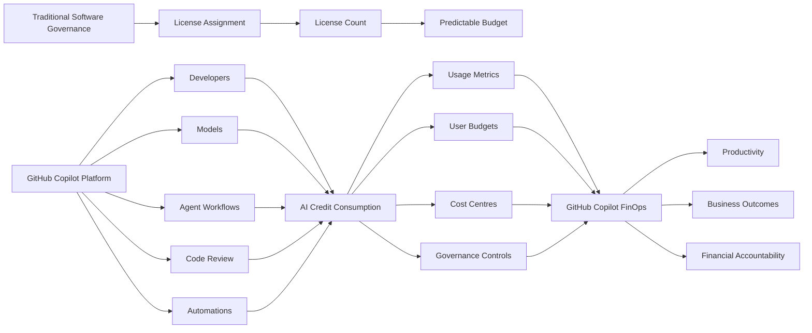
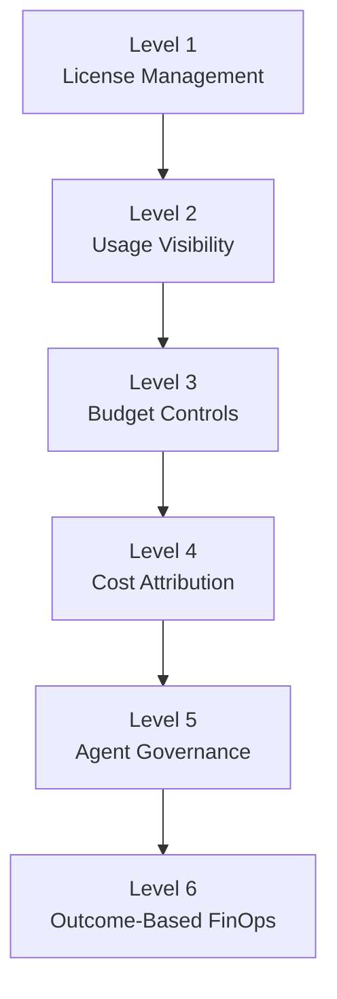

+++
title = 'GitHub Copilot FinOps: From License Management to AI Cost Governance'
slug = 'github-copilot-finops'
date = '2026-09-13 06:00:00Z'
lastmod = '2026-09-13 06:00:00Z'
draft = false
tags = [
  "GitHub",
  "GitHub Copilot",
  "FinOps",
  "AI Credits",
  "AI Governance",
  "Agentic AI"
]
categories = [
  "GitHub",
  "AI-Powered Development",
  "FinOps"
]
series = [
  "GitHub Copilot Mastery"
]

layout = "single"
[params]
    cover = true
    author = "sujith"
    cover_prompt = '''A clean, modern technical illustration showing GitHub Copilot AI consumption governance as a financial operations control plane.
    Feature a central flow from developer teams, AI models, agent workflows, code review, and automations into a shared AI credit meter, then branch into budget controls, cost centres, usage analytics, and business outcomes.
    Use a layered dashboard and architecture blueprint metaphor with credit tokens, routing paths, approval gates, and outcome indicators.
    Use deep navy, cyan, emerald, and restrained amber accents on a graphite background with subtle grid and circuit details.
    Enterprise-friendly, minimal, geometric composition for engineering leaders, platform teams, and FinOps practitioners.
    No people, no logos, no text overlays.'''

description = "Move beyond Copilot licence management with AI cost visibility, budgets, attribution, agent governance, and outcome-based FinOps."
+++

For the past two years, most GitHub Copilot conversations have focused on productivity.

How much faster can developers code?

How many pull requests can be completed?

How much time can engineering teams save?

These are important questions.

But they are no longer the only questions that matter.

With the introduction of AI Credits, usage-based billing, user-level budgets, expanding model choice, agentic workflows, and autonomous development experiences, GitHub Copilot has evolved from a developer productivity tool into something larger: a platform that requires financial governance.

Many organisations have a GitHub Copilot adoption strategy.

Far fewer have a GitHub Copilot FinOps strategy.

That gap is becoming increasingly important.

## The Shift from Fixed Costs to Variable Consumption

Historically, developer tooling was easy to budget.

You licensed:

- IDEs
- CI/CD platforms
- Security scanners
- Source control systems

Costs scaled predictably with the number of developers.

More users generally meant more licences.

GitHub Copilot introduces a different model.

While the licence remains important, consumption increasingly matters as well.

Recent GitHub billing updates introduced AI credit consumption, usage-based billing, and user-level budget controls. In addition, Copilot Code Review consumes both AI Credits and GitHub Actions minutes.

The result is that two developers with identical Copilot licences can have completely different cost profiles.

## Figure 1. From License Management to AI FinOps

**Figure 1. From License Management to AI FinOps**

Traditional developer-tool governance focuses mainly on licence counts and predictable annual budgets. GitHub Copilot introduces additional dimensions such as AI credit consumption, model selection, agent activity, governance controls and cost attribution, requiring a broader FinOps operating model.

## A Practical Example

Imagine two engineers.

### Developer A

Uses:

- code completions
- occasional chat
- pull request summaries

Perhaps five to ten Copilot interactions per day.

### Developer B

Uses:

- Agent Mode
- repository-wide analysis
- automated code review
- multiple model interactions
- delegated agent tasks

Both developers have the same licence.

Neither is behaving incorrectly.

Yet their consumption patterns may differ substantially.

Licence reporting alone cannot explain that difference.

## Mistake #1: Treating Every User the Same

One of the most common governance approaches is giving everyone identical access and identical budgets.

This sounds fair.

In practice, it is often inefficient.

Consider three common engineering personas:

### Product Engineering Teams

Building customer-facing applications.

### Platform Engineering Teams

Building reusable internal services and accelerators.

### Internal Application Teams

Maintaining reporting applications and operational tooling.

These groups frequently generate different business value from AI assistance.

Applying identical limits across all three groups may either:

- restrict high-value scenarios
- overprovision low-usage scenarios

A mature governance model aligns AI investment with business priorities rather than treating all users identically.

FinOps is not about treating everyone equally.

It is about allocating resources intentionally.

## Mistake #2: Focusing Only on Licence Costs

Many business discussions still centre around a simple question:

> How much does Copilot cost per user?

That question is becoming less useful.

The more important questions are:

- Which models are being used?
- Which teams consume the most AI Credits?
- Which workflows produce measurable value?
- Which cost centres own the consumption?
- How effectively are budgets being used?

A mature FinOps programme shifts attention from licence counts to value creation.

### Real Example: Automated Code Review

GitHub Copilot Code Review can analyse pull requests and suggest improvements.

Many organisations evaluate this only as an additional cost.

The better questions are:

- Did pull request cycle times improve?
- Did review quality improve?
- Were senior engineers freed up for higher-value work?
- Did defect escape rates decrease?

Without outcome measurement, cost numbers alone provide limited insight.

## Mistake #3: Measuring Activity Instead of Outcomes

Many organisations focus on metrics such as:

- prompts submitted
- active users
- chat sessions
- AI requests

These metrics are easy to collect.

They are also easy to misinterpret.

Consider two examples.

### Example A

A developer repeatedly asks:

> Explain this legacy codebase.

Across a very large repository.

Every day.

This consumes AI resources but may provide limited incremental value.

### Example B

A developer asks:

> Generate integration tests for our payment service before release.

Potentially similar cost.

Potentially much higher business value.

The challenge is that activity and value are not the same thing.

A mature AI governance programme measures business outcomes alongside platform usage.

## The Rise of Agentic Development

A more significant change is now underway.

GitHub continues to invest in:

- agents
- agent sessions
- delegated work
- automations
- recurring agent tasks
- repository-wide reasoning
- orchestration experiences

This signals a shift from AI assistance towards AI execution.

Developers increasingly orchestrate work rather than performing every task directly.

### Example

A developer opens an issue:

> Create regression tests for the checkout service.

A modern agent workflow may:

1. Analyse the issue
2. Inspect the repository
3. Generate tests
4. Execute validation
5. Prepare a pull request
6. Request review

The human remains accountable.

The agent performs much of the execution.

That introduces both governance and FinOps considerations.

## Agent Economics

As organisations adopt more agent-driven workflows, they will likely need a new way to think about cost attribution and governance.

I refer to this challenge as:

**Agent Economics**

Traditional software governance focused on people.

Agentic governance focuses on outcomes generated by people and agents together.

Questions organisations may increasingly need to answer include:

- Which agents are approved?
- Which models may agents use?
- What spending limits exist?
- Which actions require approval?
- Which department owns the resulting costs?
- How is value measured?

Many governance frameworks are not yet prepared for these questions.

They will need to be.

> **Key Takeaway**
>
> Most enterprises already have software asset management, cloud FinOps and security governance.
>
> Far fewer have an operating model for governing AI consumption.
>
> GitHub Copilot is often the first enterprise AI platform where that gap becomes visible.

## Governance Before Costs Become a Problem

One pattern appears repeatedly across technology adoption programmes.

Governance often arrives after costs increase.

Leadership notices a spike.

Reports are requested.

Controls are added.

Budgets are reviewed.

By then, organisations are already reacting.

The more effective approach is proactive governance.

Before scaling Copilot broadly, organisations should define:

- cost ownership
- budget structures
- approved models
- reporting approaches
- budget thresholds
- governance policies

The objective is not restriction.

The objective is confidence.

Leaders are generally willing to invest more when they understand where consumption occurs and what value it produces.

## What a Good GitHub Copilot FinOps Programme Looks Like

A mature FinOps programme should answer five questions:

### Visibility

Who is consuming AI resources?

### Attribution

Which cost centre owns the spend?

### Governance

Which models and workflows are approved?

### Optimisation

Where are AI resources generating the most value?

### Accountability

Can engineering leaders explain the business outcome created by that consumption?

If the answer to these questions is yes, organisations can scale confidently.

## Figure 2. GitHub Copilot FinOps Maturity Model

| Level | Description |
|---------|---------|
| 1 | Copilot managed primarily as a software licence |
| 2 | Usage and adoption reporting are introduced |
| 3 | Budgets and spending controls are implemented |
| 4 | Consumption is attributed to teams, departments, or cost centres |
| 5 | Governance policies control model usage and autonomous agent actions |
| 6 | AI investment is measured against engineering and business outcomes |

## Final Thoughts

The biggest misconception I encounter is that GitHub Copilot is simply another software licence.

It is not.

It is an AI platform with variable consumption, governance controls, multiple model options, automated workflows, and increasingly capable agent experiences.

The organisations that succeed will not necessarily be those that spend the least on AI.

They will be the organisations that understand where AI spending creates the most value.

The future of GitHub Copilot is not simply developer productivity.

It is developer productivity combined with financial accountability.

And as GitHub continues its evolution toward agentic software engineering, that distinction will matter more every year.

## Sources and Further Reading

### Billing, AI Credits and Budget Governance

- [GitHub Changelog: Updates to GitHub Copilot billing and plans (June 2026)](https://github.blog/changelog/2026-06-01-updates-to-github-copilot-billing-and-plans/)

### Agentic Development and Cost Visibility

- [GitHub Copilot in Visual Studio Code: June 2026 releases](https://github.blog/changelog/2026-07-08-github-copilot-in-visual-studio-code-june-2026-releases/)

- [GitHub Copilot in Visual Studio Code: July 2026 releases](https://github.blog/changelog/2026-07-30-github-copilot-in-visual-studio-code-july-2026-releases/)

### Recent GitHub Copilot Platform Updates

- [GitHub Copilot weekly releases: September 7, 2026](https://github.blog/changelog/2026-09-10-github-copilot-weekly-releases-september-7/)

### GitHub Changelog

- [September 2026 Changelog](https://github.blog/changelog/month/09-2026/)

### GitHub Documentation

- [GitHub Copilot Documentation](https://docs.github.com/en/copilot)

- [GitHub Billing Documentation](https://docs.github.com/en/billing)